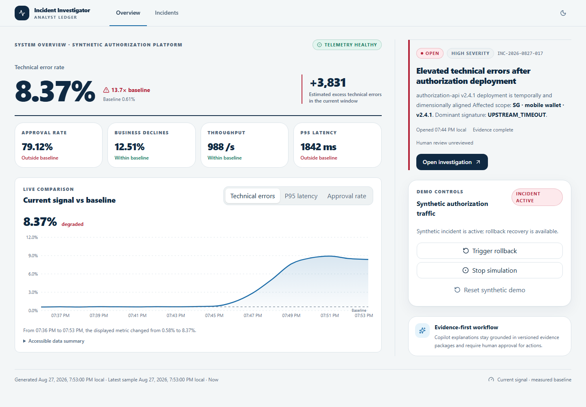

# AI Payment Incident Investigator

A synthetic-data hackathon MVP for investigating payment-platform incidents from detection through
recovery. It detects technical failures, identifies affected traffic, ranks observed operational
changes as evidence-backed root-cause hypotheses, and guides a human investigator through review.
Legitimate business declines are measured separately and never counted as technical failures.

Deterministic services own the metrics, incident lifecycle, affected scope, root-cause ranking, and
evidence. The optional AI Copilot can explain that evidence, but every material claim must cite an
approved source. If a model is disabled or its output fails validation, the product shows a clearly
labelled deterministic fallback instead of unverified model prose.



## What you can do

1. Start deterministic healthy synthetic authorization traffic.
2. Inject an allowlisted deployment regression and watch a technical incident emerge.
3. Compare current and baseline health, drill into the affected scope and error signature, and
   inspect supporting, contradictory, and missing root-cause evidence.
4. Use the incident Copilot for cited explanations and next-check guidance, then record a human
   review under the fixed server-side `demo-operator` identity.
5. Trigger rollback and observe the incident move through recovery.

## Local prerequisites

- Python 3.13
- Node.js 22 and npm 10
- Docker Desktop with a healthy Linux engine

Copy `.env.example` to `.env` for local overrides. The checked-in example contains no credentials;
real provider keys must never be committed. The application uses synthetic data only and the fixed
server-side `demo-operator` principal—there is no login screen or browser-selected identity.

## Quick start

```powershell
Copy-Item .env.example .env
docker compose up --build -d
docker compose ps
```

Open `http://localhost:3000`. This starts the live frontend, FastAPI, PostgreSQL and Redis. The API
applies idempotent migrations and seeds the deterministic synthetic projection only when the store
is empty. See `docs/demo-guide.md` for the judge path, host-development alternative and shutdown.

`AMEX_POSTGRES_DSN` is a PostgreSQL connection string consumed by the backend; it is not a browser
hyperlink. The checked-in local value targets the Compose PostgreSQL service from the host. Inside
Compose the service injects its own `postgres`-hostname DSN.

## How it works

```text
Synthetic simulator -> Redis Streams -> ingestion -> metrics and incident detection
    -> affected-scope analysis -> deterministic RCA -> immutable evidence packages
    -> PostgreSQL -> FastAPI REST/WebSocket -> Next.js investigation workspace
                                         \-> validated Copilot answer or labelled fallback
```

The local Compose stack runs six services: frontend, API, simulator, ingestion worker, PostgreSQL,
and Redis. PostgreSQL is the authoritative application store; Redis transports synthetic events.
The UI reconciles live notifications with authoritative REST reads.

## Repository guide

- [`backend/`](backend/) contains the FastAPI application, detection and analysis pipeline,
  evidence builder, Copilot controls, persistence, migrations, and backend tests.
- [`simulator/`](simulator/) generates the deterministic synthetic payment and operational events.
- [`frontend/`](frontend/) is the accessible Next.js investigation workspace.
- [`scripts/`](scripts/) contains contract generation, live-stack verification, browser-test, and
  model-evaluation utilities.
- [`tests/`](tests/) and [`backend/tests/`](backend/tests/) cover cross-service and backend behavior.
- [`docs/`](docs/) contains the architecture, demo, safety boundaries, decisions, and verification
  evidence.

## Contract generation

```powershell
.\.venv\Scripts\python.exe scripts\generate_contracts.py
```

This exports `backend/contracts/openapi.v1.json`, regenerates
`frontend/generated/api-types.ts`, and runs strict TypeScript validation. Pydantic/OpenAPI is the
sole public API source of truth; frontend aliases and repositories import the generated schemas.

## Verification

```powershell
.\.venv\Scripts\python.exe -m pytest
cd frontend
npm.cmd run typecheck
npm.cmd run lint
npm.cmd test
npm.cmd run test:browser
```

With PostgreSQL and Redis running, the real transport/demo gate is:

```powershell
$env:AMEX_RUN_POSTGRES_TESTS="1"
.\.venv\Scripts\python.exe -m pytest
.\.venv\Scripts\python.exe scripts\verify_live_stack.py
```

## Redis-backed simulator

```powershell
docker compose up -d redis
.\.venv\Scripts\python.exe -m simulator.main start
.\.venv\Scripts\python.exe -m simulator.main inject
.\.venv\Scripts\python.exe -m simulator.main recover
.\.venv\Scripts\python.exe -m simulator.main reset
```

The commands emit only synthetic, schema-validated events. The reset command deletes only keys in
the `amex:synthetic:*` namespace; it never flushes the Redis database.

## Copilot provider and evaluation

The safe default is `AMEX_COPILOT_PROVIDER=disabled`, which returns a labelled deterministic
fallback without model prose. The provider-neutral implementation supports exactly one selected
runtime provider/model. The Claude Sonnet 5 versus GPT-5.6 Terra result is pending credentials; no
winner has been fabricated. Exact environment-variable names and commands are documented in
`docs/model-evaluation.md`.

## Documentation

- [Local setup and judge demo](docs/demo-guide.md)
- [Architecture and methodology](docs/architecture.md)
- [Business value and product limits](docs/business-value.md)
- [Responsible-AI and security boundary](docs/responsible-ai.md)
- [Frontend component manifest](docs/component-manifest.md)
- [Implementation decisions](docs/implementation-decisions.md)
- [Copilot model-evaluation status](docs/model-evaluation.md)
- [Stage checkpoints](docs/stage-checkpoints.md)
- [Authoritative-source traceability](docs/source-traceability.md)
